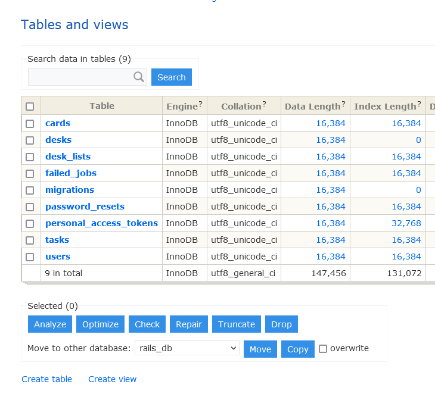

# CSS theme for Adminer  
CSS theme for Adminer database tool ([www.adminer.org](http://www.adminer.org/)).    
  

## How to use:  
1. [Download](http://www.adminer.org/#download) and install Adminer tool.
2. Copy the css file of the theme (adminer.css) to the folder with Adminer tool.
3. Refresh the page in the browser

## Remarks:    
This css theme is compatible with Adminer version 4.8.1 (and earlier versions)  
More than 50 changes have been made since the last update.  
